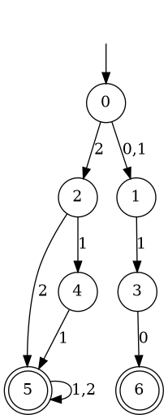
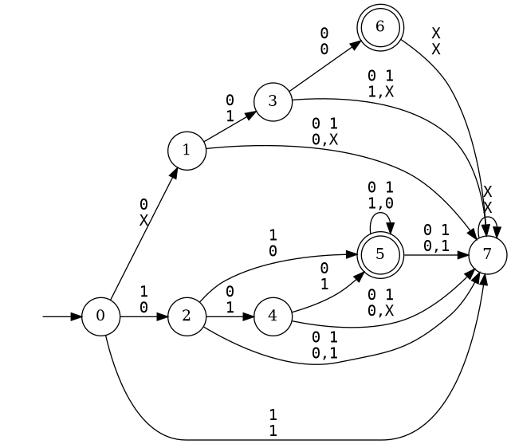
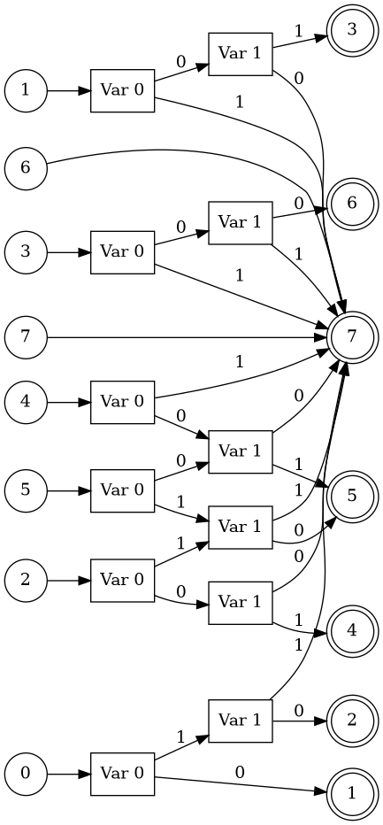

# MaMONAta
MaMONAta is a library that provides an adapter for Mata and MONA implementations of automata.
It allows users to easily convert between different automata implementations and transparently
compare the performance of the two tools.

## Features
- Parsing of automata in `.mata` and `.mona` formats.
- All possible conversions between Mata and MONA automata.
- Transparent performance comparison between Mata and MONA implementations.
- `Timer` class for measuring the execution time of functions.
- `MtRobdd` class implementing Multi-terminal Reduced Ordered Binary Decision Diagrams (MtROBDDs).
- DOT visualization of Mata, MONA, and MtROBDD structures.

## Automata Operations
| Operation                 | Mata | MONA |
|--------------------------:|:----:|:----:|
| trim                      |   ✓  |      |
| remove_epsilon            |   ✓  |      |
| revert                    |   ✓  |      |
| minimize_brzozowski       |   ✓  |      |
| minimize_hopcroft         |   ✓  |      |
| minimize                  |      |   ✓  |
| reduce_simulation         |   ✓  |      |
| reduce_residual           |   ✓  |      |
| concatenate               |   ✓  |      |
| union_nondet              |   ✓  |      |
| union_det_complete        |   ✓  |   ✓  |
| determinize               |   ✓  |   ✓  |
| intersection              |   ✓  |   ✓  |
| complement_classical      |   ✓  |      |
| complement_brzozowski     |   ✓  |      |
| complement                |      |   ✓  |

All these operations are timed in default. The timing can be disabled by setting the `TIMING_ENABLED` option in `CMakeLists.txt` to `OFF`.
To obtain the timing results, use the `get(operation_name)` method of the `Timer` class.

## Timing
The library provides a singleton `Timer` class that can be used to measure the execution time of various operations.
The timing results can be obtained using the `get(operation_name)` method of the `Timer` class.
All standard automata operations are timed by default. To start a custom timing use `start(custom_name)` and to stop it use `stop(custom_name)`.

## MtROBDD
The `MtRobdd` class implements a Shared Multi-terminal Reduced Ordered Binary Decision Diagrams (MtROBDDs).
There is one MtROBDD instance per automaton that represents the transition function of the automaton.
Below you can see an example of Mata automaton in the DOT format, mona automaton in the DOT format, and its corresponding shared MtROBDD representation.





## MONA Implementation Secrets

### Alphabet
In order to support nonbinary alphabets in MONA, MaMONAta encodes each symbol using multiple binary variables. It uses $log_2(|\Sigma|)$ variables to represent an alphabet of size $|\Sigma|$.

**!!WARNING!!:** When performing operations that combine multiple automata (e.g., union, intersection, concatenation),
the user is responsible for ensuring that the alphabet encodings are consistent across all automata involved in the operation.

### Nondeterminism
MaMONAta allows MONA to represent nondeterministic automata by introducing additional variables to encode nondeterministic choices. These variables are put at the end of the variable ordering.
The determinization of the automaton is then performed by projecting out these nondeterministic choice variables. The placement of these variables at the end of the variable ordering makes the projection more efficient than if they were put at the beginning, which would lead to more difficult determinization of the shared MtROBDD representation.

**!!WARNING!!:** When performing any MONA operation on the automaton, the user is responsible for ensuring that there are no nondeterministic choice variables present in the automaton. The existence of such variables would lead to incorrect results. For example, two sequences, containing one alphabet variable and one nondeterministic variable (00 and 01), and differ only in the value of the nondeterministic choice variables, would be considered two different symbol encodings during operations like union or intersection, which is not the intended behavior.

### Complete Transition Function
MONA always works with complete transition functions. If the automaton is converted from Mata and has an incomplete transition function, MaMONAta adds a sink state to the automaton to make the transition function complete.

### Reduced BDD
MONA relies on reduced BDDs to represent the transition function of the automaton. If the provided BDD is not reduced, the behavior of MONA is undefined.

**!!WARNING!!:** When manually building a `.mona` file, the user is responsible for ensuring that the BDD is reduced.

## MONA Format
The following is a `.mona` file representing an automaton from above:
```
MONA DFA
number of variables: 2
variables: A0 A1
orders: 0 0
states: 8
initial: 0
bdd nodes: 19
final: -1 -1 -1 -1 -1 1 1 -1
behaviour: 0 5 8 13 16 18 2 2
bdd:
 0 4 1
 1 3 2
 -1 7 0
 -1 2 0
 -1 1 0
 0 6 2
 1 2 7
 -1 3 0
 0 11 9
 1 10 2
 -1 5 0
 1 2 12
 -1 4 0
 0 14 2
 1 15 2
 -1 6 0
 0 17 2
 1 2 10
 0 17 9
end
```
- `MONA DFA` is a mandatory header indicating that the file represents a deterministic finite automaton.
- `number of variables` specifies the number of binary variables used to encode the alphabet.
- `variables` lists the names of the variables used in the BDD representation. MaMONAta uses the prefix `A` for alphabet variables and `N` for nondeterministic choice variables.
- `orders` indicates the order of each variable in the BDD.
- `states` indicates the total number of states in the automaton.
- `initial` specifies the initial state of the automaton.
- `bdd nodes` indicates the number of nodes in the BDD representation.
- `final` is a list indicating the acceptance status of each state. A value of `1` indicates an accepting state, while `-1` indicates a non-accepting state. `0` is not used in Mata and is reserved for special use with WS1S in MONA.
- `behaviour` lists the BDD node indices corresponding to the beginning of the transition function for each state.
- `bdd` section contains the BDD nodes, each represented by three values: variable index, low child index, and high child index. A negative variable index indicates a terminal node, with the name/value of the target state being stored in the low child index. The high child index is unused for terminal nodes and is set to `0`.

## Building MaMONAta
Download the repositories by running the script `extern/download.sh`.
Build the project using `make release` or `make debug` for a debug build.
In `CMakeLists.txt`, you can choose whether to time the operations by setting the `TIMING_ENABLED` option to `ON` or `OFF`.

## Project Structure
- `include/mata-bridge/` - header files for the MaMONAta adapter.
- `include/mona-bridge/` - header files for the MONA adapter.
- `include/mtrobdd.hh` - header file for the MtROBDD implementation.
- `include/timer.hh` - header file with the Timer class.
- `src/mtrobdd.cc` - implementation of the MtROBDD.
- `src/mata-bridge/` - Mata adapter code.
- `src/mona-bridge/` - MONA adapter code.
- `extern/download.sh` - script to download the required external libraries.
- `extern/mata/` - Mata library.
- `extern/MONA/` - MONA library.
